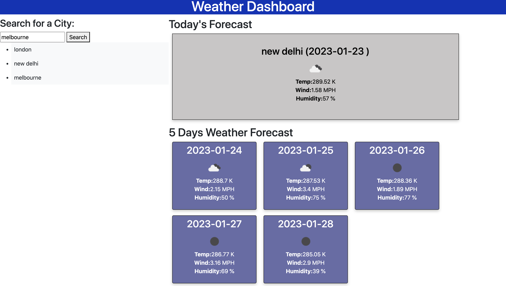

# Weather-Dashboard

## Description

The following project generates the current and future weather conditions of a city searched by user. It displays the current temperature, humidity and wind speed followed by next 5 days of weather forecast for that city. The searched cities are stored in local storage and displayed on the webpage. If a user clicks a city from the search list then the weather forecast for that city is displayed again. 

## Installation

Clone the Weather-Dashboard repository to your local machine. The Weather-Dashboard folder contains an index.html file, a style.css file and a script.js file. 

## Usage

Open the index.html file in VS Code and run the file in the browser to view the webpage. 

## License

Please refer to the license in the repository

## Deployed Application link

https://taniachahal97.github.io/Weather-Dashboard/
